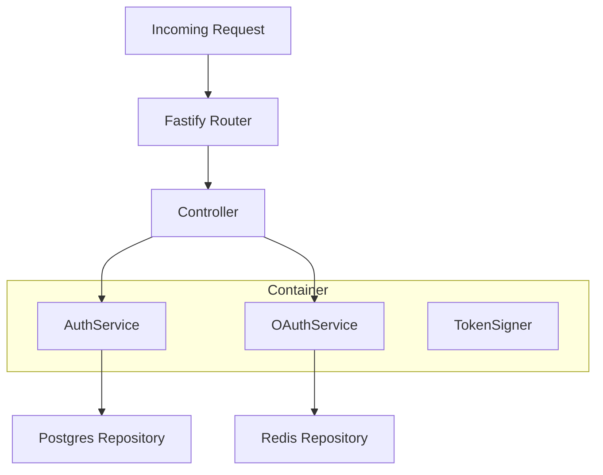
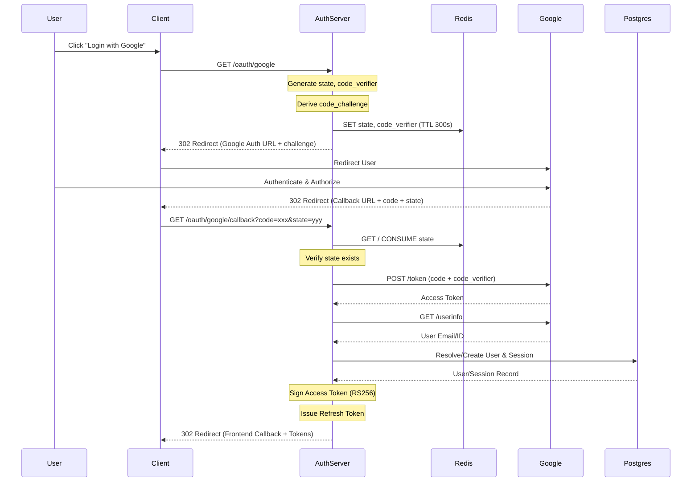
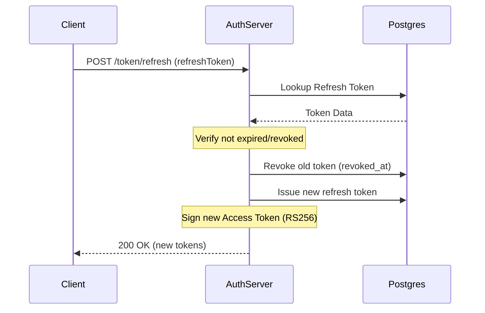

# DeCentralAuth Request Flow Documentation

This document provides a technical deep dive into the lifecycle of a request within the DeCentralAuth platform, from admission to persistence.

## Admission Control and Middleware

DeCentralAuth uses **Fastify** as its web framework, which provides a high-performance request-response pipeline.

### 1. Pre-Handler Pipeline
Every request passes through several global hooks and plugins:
- **CORS**: Validates the `Origin` header against allowed domains and handles preflight `OPTIONS` requests.
- **Cookie Parsing**: Extracts and decrypts cookies using the `COOKIE_SECRET`.
- **Fastify Hook: `onRequest`**: Used for initial logging and any global authentication checks.

### 2. Dependency Injection
DeCentralAuth uses a centralized container pattern (`src/bootstrap/container.ts`) for dependency resolution. Services are instantiated once at startup and injected into controllers/routes.



## Detailed Flow: Google OAuth (Authorization Code Flow with PKCE)

The OAuth flow is a multi-step process involving the client, the DeCentralAuth server, and Google's identity provider.



### Phase 1: Initiation (`/oauth/google`)
1. **Request**: User clicks "Login with Google".
2. **State Generation**: Server generates a cryptographically secure `state` and a PKCE `code_verifier`.
3. **PKCE Challenge**: Server derives a `code_challenge` (S256) from the `code_verifier`.
4. **Persistence**: The `state` and `code_verifier` are stored in **Redis** with a 300-second TTL.
5. **Redirect**: Server redirects the user to Google with the `client_id`, `state`, and `code_challenge`.

### Phase 2: Callback (`/oauth/google/callback`)
1. **Request**: Google redirects back with an authorization `code` and the `state`.
2. **State Validation**: Server retrieves the `state` from Redis. If missing or mismatched, the request is rejected (CSRF protection).
3. **Code Exchange**: Server sends the `code` and the original `code_verifier` to Google's token endpoint.
4. **Identity Resolution**:
    - Server fetches user info from Google using the retrieved access token.
    - `OAuthService` resolves the Google identity to a local user record in PostgreSQL.
5. **Session Creation**:
    - `AuthService` creates a new session in PostgreSQL.
    - `RefreshTokenService` issues a rotated refresh token.
    - `AccessTokenSigner` produces a signed RS256 JWT.

## Detailed Flow: Refresh Token Rotation

To ensure high security, refresh tokens are rotated on every use.



## Persistence Patterns

The system distinguishes between **ephemeral** and **durable** data.

| Data Type | Storage | Responsibility | Flow |
| :--- | :--- | :--- | :--- |
| **OAuth State** | Redis | `RedisOAuthStateRepository` | Created at initiation, consumed at callback. |
| **User Data** | PostgreSQL | `PostgresUserRepository` | Fetched during login/resolution. |
| **Sessions** | PostgreSQL | `PostgresSessionRepository` | Created at login, invalidated at logout. |
| **Refresh Tokens** | PostgreSQL | `PostgresRefreshTokenRepository` | Rotated with every usage. |

## Error Handling Pipeline

Errors are handled via a uniform approach to ensure predictable API responses.

1. **Service Layer**: Throws specific domain errors (e.g., `INVALID_REFRESH_TOKEN`).
2. **Controller Layer**: Catches domain errors and maps them to HTTP status codes.
3. **Response Schema**:
   ```json
   {
     "error": "ERROR_CODE",
     "message": "Human readable description (optional)"
   }
   ```

## Security Audit: PKCE Verification
The PKCE check ensures that even if an attacker intercepts the authorization code, they cannot exchange it for tokens because they lack the `code_verifier` stored in the server's Redis instance. This is critical for public clients (like SPAs) where the `client_secret` cannot be securely stored.
